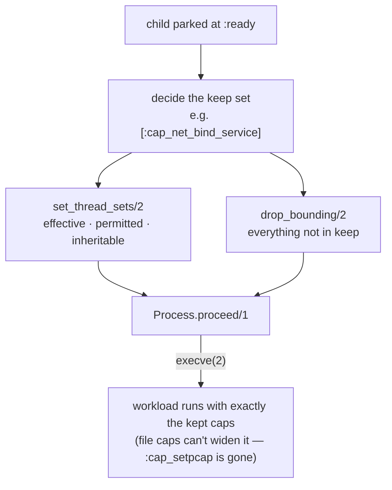

# Linx.Capabilities

`Linx.Capabilities` reads and shrinks a workload's Linux **capabilities** —
the fine-grained powers that replace the all-or-nothing "root vs not-root"
distinction — so a process runs with exactly the privileges it needs and no
more.

## Overview

Linux splits the historical omnipotence of root into ~41 discrete capabilities
(`CAP_NET_ADMIN`, `CAP_SYS_ADMIN`, `CAP_NET_BIND_SERVICE`, …), each held in one
of a thread's five capability sets: **effective**, **permitted**,
**inheritable**, **bounding**, and **ambient**. A hardened runtime drops
everything a workload doesn't need *before* `execve`, so that a later
compromise of the workload can't reach for kernel surface it never required.
`Linx.Capabilities` represents sets as plain `MapSet`s of `:cap_*` atoms — so
`MapSet.difference/2` and pattern matching just work — and confines the
bitmask conversion to one place. The read side is host-side procfs; the write
side, because capability changes act on the *calling thread*, runs inside the
child agent.

## Where it fits

This is a checkpoint-window verb. `set_thread_sets/2`, `drop_bounding/2`, and
`set_ambient/2` are valid only while the child is parked at the `:ready`
checkpoint — the same commit shape as `Linx.Seccomp.install/2` and
`Linx.Process.proceed/1` — because `capset(2)` and the `prctl` bounding/ambient
calls only affect the thread that issues them, so the agent must do its own
configuration before `execve`. It sits beside `Linx.Seccomp` (syscall surface)
and `Linx.User` (identity) as the privilege-shrinking verbs a container engine
sequences around the checkpoint. It is a primitive, not a policy engine: *which*
caps a given workload keeps is a decision its consumer makes.

## Flow

## Learn more

- **API** — `Linx.Capabilities` (verbs `read/1`, `set_thread_sets/2`,
  `drop_bounding/2`, `set_ambient/2`), with `Linx.Capabilities.State` and
  `Linx.Capabilities.Error`
- **Examples** — [capabilities-examples.md](capabilities-examples.md): reading a process's sets, the
  drop-to-minimum recipe, ambient caps
- **References** — [capabilities-references.md](capabilities-references.md): `capabilities(7)` and the
  per-thread syscall surface
