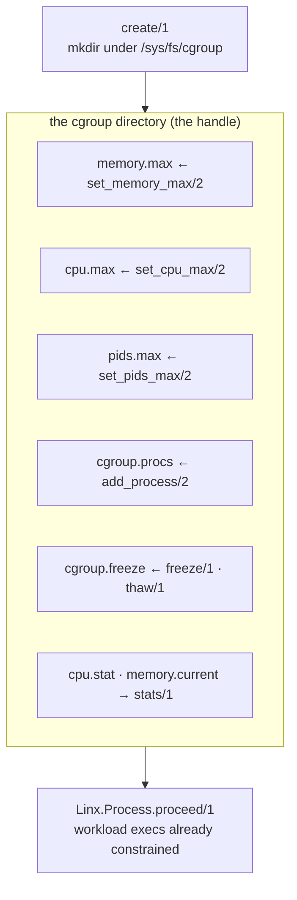

# Linx.Cgroup

`Linx.Cgroup` puts a Linux workload under a resource ceiling — memory, CPU,
process count — and reads back what it actually consumed, using cgroup v2 and
nothing but the filesystem the kernel already exposes.

## Overview

cgroup v2 is how Linux accounts for and limits what a tree of processes may
consume. Its entire interface is a directory under `/sys/fs/cgroup`: each cgroup
is a folder, each knob (`memory.max`, `cpu.max`, `pids.max`) a file you write,
each counter (`memory.current`, `cpu.stat`) a file you read. There is no
syscall, no daemon, no NIF — `Linx.Cgroup` is plain `File.read/1` and
`File.write/2` against that tree, wrapped in typed setters, structured errors,
and a `Stats` reader that copes with counters newer kernels invent.

The path *is* the handle. `create/1` returns the cgroup's path; every other verb
takes it. There's no opaque struct or GenServer — cgroupfs already supplies the
identity, and Linx declines to invent a second one on top.

## Where it fits

`Linx.Cgroup` is one of the subsystems that reaches into a child while it is
parked at the `Linx.Process` checkpoint. `add_process/2` places the parked pid
into a cgroup *before* `proceed/1`, so the workload's first instruction already
runs inside its ceiling — the same window `Linx.User`, `Linx.Netlink`, and
`Linx.Seccomp` use. `Linx.Process` knows nothing of cgroups; the checkpoint is
the whole of the coupling.

It is equally useful with no clone in sight: any host pid — including BEAM
processes — can be supervised. Linx supplies primitives, never policy: the
caller picks the path, delegates controllers, and decides naming. A container
engine built on Linx is the consumer that sequences create → delegate → limit →
place around the checkpoint.

## Flow

## Learn more

- **API** — `Linx.Cgroup` (with `Linx.Cgroup.Stats`, `Linx.Cgroup.Reconcile`,
  and `Linx.Cgroup.Error`)
- **Examples** — [cgroup-examples.md](cgroup-examples.md): lifecycle, limits, freeze/thaw,
  counters, controller delegation, reconciliation
- **References** — [cgroup-references.md](cgroup-references.md): the cgroup v2 kernel docs and
  man pages
