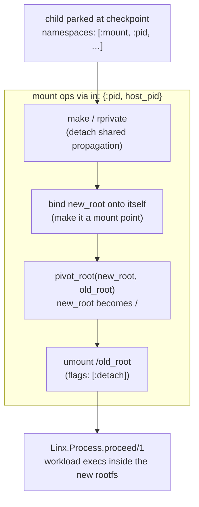

# Overview

`Linx.Mount` shapes the filesystem hierarchy a process sees — mounting,
unmounting, bind-mounting, and pivoting the root — and reads the mount table
back, in the BEAM's own mount namespace or inside another process's.

A mount namespace is the set of mounts a process sees as its filesystem tree.
`Linx.Mount` wraps the classic syscalls that build and reshape it — `mount(2)`,
`umount2(2)`, `pivot_root(2)` — plus the read-side parser for
`/proc/.../mountinfo`. It deliberately wraps the classic calls rather than the
newer `fsopen`/`fsmount` family: they map one-to-one onto the `mount` and
`umount` commands operators already know, and each is a single-shot call that a
NIF can wrap safely without forking.

The headline capability is `pivot_root`: swapping a workload onto a custom
rootfs before it runs — exactly what a container runtime does. The picky kernel
constraints around it (new root must be a mount point, no shared propagation on
ancestors, CWD inside the new root) are satisfied by a setup ritual the
examples spell out.

## Where it fits

`Linx.Mount` is a checkpoint subsystem. A child spawned with `namespaces:
[:mount, :pid]` gets a *copy* of the host's mount table — so it still sees the
host's `/proc`. Mounting a fresh `/proc` into the child's namespace before
`proceed/1` is the fix, alongside `Linx.User`, `Linx.Cgroup`, and the rest.

What makes it lifecycle-agnostic is the `:in` option. Every mutating verb takes
`in: :self | {:pid, n} | {:path, p}`, targeting any process whose namespace
files exist — parked at a checkpoint, fully running, or any other live pid. The
mechanism is the same throwaway-pthread `setns(2)` trick `Linx.Netlink` and
`Linx.Sysctl` use, with one twist: the worker `unshare(CLONE_FS)`s first, since
the kernel refuses a mount-namespace `setns` from a thread sharing its
`fs_struct` with the BEAM's schedulers. A container engine is the consumer that
sequences make-rprivate → bind → pivot_root → umount-old around the checkpoint.

## Flow

## Learn more

- **API** — `Linx.Mount` (with `Linx.Mount.Entry` for parsed mountinfo rows and
  `Linx.Mount.Error`)
- **Examples** — [mount-examples.md](mount-examples.md): reading the table, bind/remount/move,
  cross-namespace mounts, the full `pivot_root` ritual
- **References** — [mount-references.md](mount-references.md): the mount syscalls,
  propagation docs, and man pages
