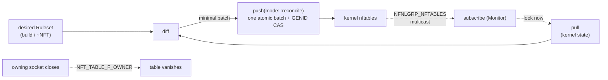

# Linx.Netfilter

`Linx.Netfilter` is the kernel's modern firewall — nf_tables — modelled as plain
Elixir values, applied atomically, and (optionally) kept live by reconciling the
value you want against the rules the kernel actually holds.

## Overview

nf_tables is a single coherent kernel surface — packet filtering, NAT,
connection tracking, and packet-event streams — reached over the
`NETLINK_NETFILTER` family. `Linx.Netfilter` represents a whole ruleset
(`%Ruleset{}`: tables → chains → ordered rules, plus sets, maps, vmaps and named
objects) as ordinary, inspectable data, with four verbs over it: **build** a
ruleset (pipeline DSL or `~NFT` sigil), **pull** the kernel's current state into
a value, **diff** two rulesets into a patch, and **push** a ruleset to the
kernel. Every mutation rides a mandatory `BATCH_BEGIN`/`BATCH_END` transaction:
the kernel applies the whole batch or rejects it whole. Kernel state lives in the
kernel; the Elixir value is just a value.

## Where it fits

Netfilter is a concept module peer to `Linx.Process`, `Linx.Cgroup`,
`Linx.User`, `Linx.Seccomp` and the rest — the firewall mental model made
explicit. It rides `Linx.Netlink.Nfnl` (mirroring how `Rtnl` rides the same wire
core), so a ruleset can be pushed into the host's netns or, via
`Nfnl.open({:pid, n})`, into a child's fully isolated nftables instance. Each
netns has its own tables, generation counter, and commit mutex. Its consumers are
firewall appliances and container orchestrators; its `pull`/`diff`/`push`/
`subscribe` shape is the reference template that `Linx.Reconcile` generalises.

## Flow

Two properties stand out. First, the reconcile cycle: pull current state, diff
against desired, push only the minimal patch as one batch — guarded by the
kernel's generation counter (`BATCH_GENID`) so a concurrent `nft`/firewalld
writer is detected and the push retried rather than clobbering. Second, the
*owner* table: by default a table is destroyed when the socket that created it
closes, so the firewall's lifetime is the owning supervisor's lifetime.

## Learn more

- **API** — `Linx.Netfilter` (with `Linx.Netfilter.Ruleset`, `Table`, `Chain`,
  `Rule`, `Set`/`Map`/`Vmap`, `Object`, `Monitor`, and `Log` for NFLOG)
- **Examples** — [netfilter-examples.md](netfilter-examples.md): building, pushing, pulling,
  diffing, monitoring, and NFLOG capture
- **References** — [netfilter-references.md](netfilter-references.md): the nfnetlink protocol and
  nft kernel surface
