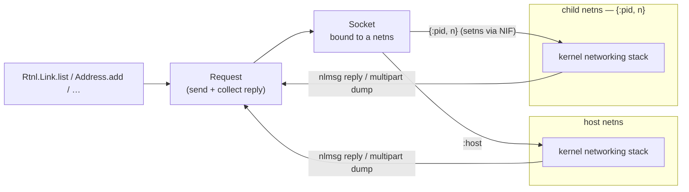

# Overview

`Linx.Netlink` is Elixir's voice on the kernel's `AF_NETLINK` bus — the socket
through which userspace asks the kernel to *do* things and *report* state, with
the wire format encoded and decoded in pure Elixir.

Netlink is the kernel's structured request/reply (and broadcast) channel for a
whole family of subsystems: the networking stack via rtnetlink, the firewall via
nfnetlink, and — through generic netlink — WireGuard, nl80211 and more. Each
message is an `nlmsghdr` envelope wrapping type-length-value attributes.
`Linx.Netlink` speaks that protocol directly: a small layered codec
(`Socket` → `Message`/`Attr` → `Request`), family-agnostic at the bottom, with
each protocol family — `Rtnl` for networking, `Nfnl` for netfilter — built on
top. A single tiny NIF handles the one thing the BEAM cannot do safely itself:
entering another network namespace to bind the socket there.

## Where it fits

Netlink is how the other subsystems reach into the kernel's networking world.
While a child is parked at the `Linx.Process` checkpoint, `Linx.Netlink.Rtnl`
moves an interface into its netns and assigns addresses and routes — so the
workload's first instruction already sees a configured network. It is also the
transport `Linx.Netfilter` rides on (via `Linx.Netlink.Nfnl`). The wire layers
are shared and family-agnostic; consumers are container engines and network
orchestrators that sequence rtnl calls around the checkpoint, plus anything that
just wants to inspect or configure host networking.

## Flow

A socket is bound *in a chosen namespace* — the host, or a child's netns by pid —
and every request it sends, and reply it collects, lands in that namespace's
networking stack.

## Learn more

- **API** — `Linx.Netlink` (with `Linx.Netlink.Socket`, `Linx.Netlink.Message`,
  `Linx.Netlink.Attr`, `Linx.Netlink.Request`, `Linx.Netlink.Codec`) and the
  rtnetlink family `Linx.Netlink.Rtnl` (`Link`, `Address`, `Route`, `Neighbour`,
  `Rule`, plus `Monitor`)
- **Examples** — [netlink-examples.md](netlink-examples.md): sockets, namespaces, listing and
  mutating links, addresses, and routes
- **References** — [netlink-references.md](netlink-references.md): the netlink protocols and
  kernel man pages
