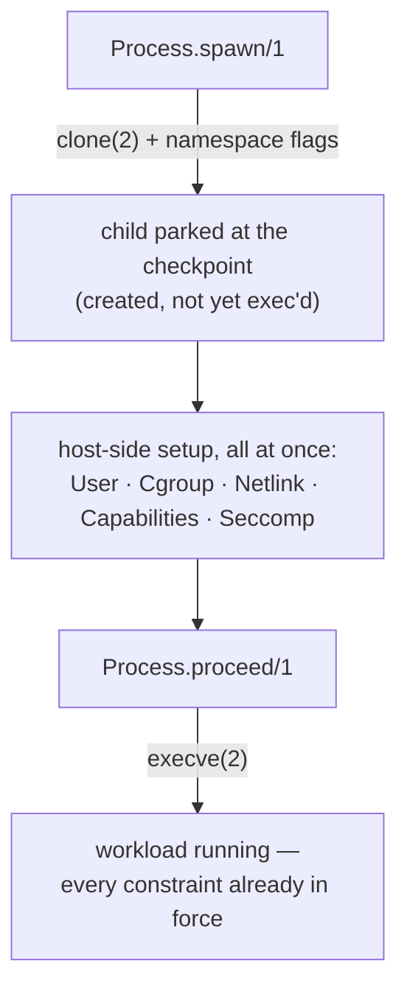
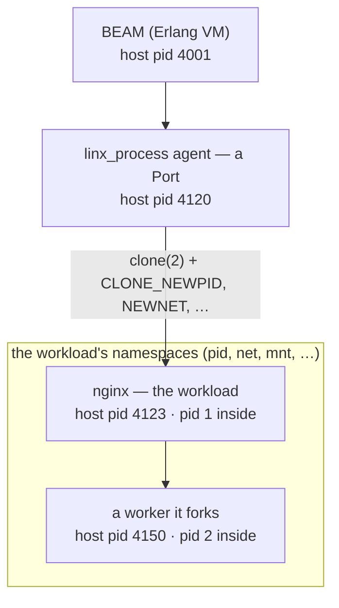

# Linx.Process

`Linx.Process` spawns a Linux workload through the **checkpoint**: the window
between `clone(2)` and `execve(2)` where the child is parked — fully created but
not yet running — so every other subsystem can configure it before its first
instruction.

## Overview

A plain `fork`+`exec` gives you no moment to act between "the process exists" and
"the program is running". `Linx.Process` opens exactly that moment. It `clone(2)`s
a child with the namespace flags you ask for, drives it through a small external C
*agent* — a Port, never a NIF, because `clone()`/`unshare()` inside the
multithreaded BEAM would corrupt the VM — and **parks** it at the checkpoint. Only
when you call `proceed/1` does the child `execve` the real workload.

## Where it fits

The checkpoint is the seam the rest of Linx hooks into. While the child is parked,
you reach into it from the host:

- `Linx.User` writes uid/gid maps (the rootless "root inside ↔ me outside" trick).
- `Linx.Cgroup` places it under a memory / cpu / pids ceiling.
- `Linx.Netlink.Rtnl` moves a network interface into its netns.
- `Linx.Capabilities` and `Linx.Seccomp` shrink its privileges and syscall surface.

Identity, resources, network, privilege, and syscalls are all decided *at once*,
before `execve` — so the workload's first instruction already runs fully
constrained. A container engine or network orchestrator is a *consumer* that
sequences these around the checkpoint; `Linx.Process` only provides the moment.

## Flow

## Process tree

The workload is never a direct child of the BEAM: the agent Port sits between
them and is the workload's real parent — it `clone(2)`s the child and reaps it.
When the `:pid` namespace is requested, the workload becomes **pid 1 inside** its
namespace while keeping a distinct **host pid** outside (the number `host_pid/1`
returns). Anything it spawns gets the next pids inside (pid 2, …), each with its
own host pid.

## Learn more

- **API** — `Linx.Process` (with `Linx.Process.Error` and `Linx.Process.Info`)
- **Examples** — [process-examples.md](process-examples.md): spawning, the checkpoint, namespaces,
  signals, stdio, attaching, supervision
- **References** — [process-references.md](process-references.md): the kernel syscalls and man pages
