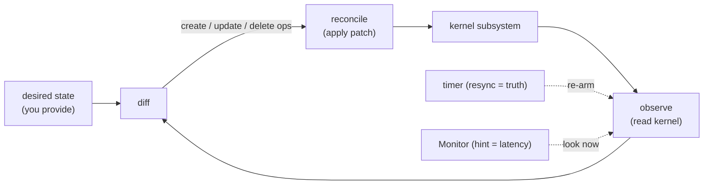

# Linx.Reconcile

`Linx.Reconcile` is a thin, opt-in control loop that keeps one kernel subsystem
converged on a desired state — re-observing and re-diffing on a timer, and
reacting within milliseconds to a change event when the subsystem offers one.

## Overview

A single `reconcile` call — observe current state, diff against desired, apply
the minimal patch — is correct exactly once. Real systems drift: a manual `ip`
command, a crash, a reboot. `Linx.Reconcile` turns the single-shot mechanism into
*continuous* convergence: a level-triggered loop that resyncs periodically (the
correctness layer — drift is healed on the next pass) and, where a subsystem
Monitor exists, wakes immediately on a change hint (a latency layer over the
timer). **Events are hints; resync is truth.** It is deliberately minimal: no
boot side effects, no global state, no singleton — it holds only the desired
state and the ownership you hand it, and drives exactly one
`Linx.Reconcile.Source` in one namespace.

## Where it fits

This is the optional capstone over Linx's reconcilable subsystems. Each one —
`Linx.Netfilter` (the original template), `Linx.Netlink.Rtnl`, `Linx.Sysctl` —
exposes the same four verbs (observe, diff, reconcile, subscribe) behind a
`Linx.Reconcile.Source` adapter; `Linx.Reconcile` is built entirely on that
public contract, so deleting it would cost a consumer only a ~15-line timer loop.
It is single-subsystem by construction: the cross-subsystem composite ("this
container, with this network, in this cgroup, bound to this process") belongs to
the consumer — an orchestrator — never here. You add
`{Linx.Reconcile, opts}` to *your own* supervision tree; Linx ships nothing that
starts it for you.

## Flow

The classic closed-loop control model: desired and observed states feed a diff,
the resulting patch is applied, and the loop is re-armed — by a periodic timer
for correctness, or sooner by a Monitor hint for latency.

## Learn more

- **API** — `Linx.Reconcile` (the opt-in loop) and `Linx.Reconcile.Source` (the
  per-subsystem plug-in contract)
- **Examples** — [EXAMPLES.md](EXAMPLES.md): the shared reconcile model, the
  opt-in loop, the Source contract, and how the pieces fit
