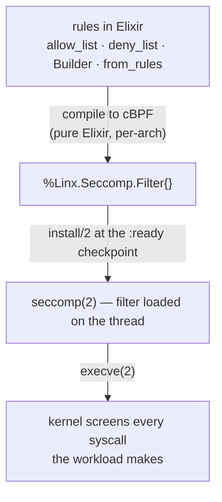

# Linx.Seccomp

`Linx.Seccomp` builds and installs **seccomp** syscall filters — small kernel
programs that gate every syscall a workload makes — so a process drops to a
documented syscall envelope before its first instruction.

## Overview

A seccomp filter is a tiny cBPF program the kernel runs on every syscall entry;
its return value decides whether the syscall is allowed, fails with an errno,
kills the thread, or is logged. Filters install per-thread, never come off, and
only ever tighten — which makes them a durable way to shrink a workload's
attack surface: a kernel bug behind a syscall the filter forbids simply can't
be reached. `Linx.Seccomp` lets you describe the policy in Elixir — `allow_list/2`,
`deny_list/2`, or the fluent `Linx.Seccomp.Builder` — or hand it raw
`[{action, syscall}]` rules translated from an external profile (a Docker
`seccomp.json`, say). It then **compiles the rules to cBPF in pure Elixir**, no
libseccomp dependency, and the child agent issues the `seccomp(2)` syscall at
the checkpoint. It is a primitive: which syscalls a given workload needs is
policy that lives in a consumer.

## Where it fits

`install/2` is a checkpoint-window verb — valid only while the child is parked
at `:ready`, the same commit shape as `Linx.Capabilities.drop_bounding/2` —
because the kernel forbids installing a filter on another thread, so the agent
must install it on itself before `execve`. It sits alongside `Linx.Capabilities`
(privileges) and `Linx.User` (identity) as the verbs that constrain a workload
at the checkpoint. Filters typically pair with `no_new_privs`, set at
`Linx.Process.spawn/1`. A container engine is the consumer that maps a workload
to its profile and sequences the install.

## Flow

## Learn more

- **API** — `Linx.Seccomp` (verbs `allow_list/2`, `deny_list/2`, `from_rules/1`,
  `install/2`), with `Linx.Seccomp.Builder` (the fluent DSL),
  `Linx.Seccomp.Filter`, and `Linx.Seccomp.Error`
- **Examples** — [EXAMPLES.md](EXAMPLES.md): allow/deny lists, the Builder,
  importing external profiles, default actions
- **References** — [REFERENCES.md](REFERENCES.md): `seccomp(2)` and the cBPF /
  `seccomp_filter` kernel docs
