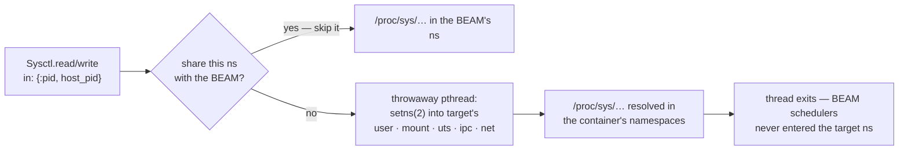

# Linx.Sysctl

`Linx.Sysctl` reads and writes the kernel's tunable parameters — the `/proc/sys/`
knobs `sysctl(8)` exposes — on the host or, crucially, inside another process's
namespaces.

## Overview

Sysctls are the kernel's ~1500 named scalar tunables, spanning networking, the
VM, the filesystem layer, IPC, and kernel-wide policy. Each is a file under
`/proc/sys/`, with dots in the name mapping to slashes in the path
(`net.ipv4.ip_forward` → `/proc/sys/net/ipv4/ip_forward`). `Linx.Sysctl` is a
typed wrapper over that procfs surface: `read/1` and the parsing helpers
(`read_int/1`, `read_ints/1`) on one side, `write/2` taking integers, strings,
and integer lists on the other, plus `list/1` to walk a subtree.

The legacy `sysctl(2)` syscall was removed from Linux in 5.5; procfs is the only
API, and the right one. Linx supplies primitives — read, write, list — not a
`sysctl.conf` applier; parsing `/etc/sysctl.d` and reload policy belong to a
consumer. Single-shot reconciliation of a desired `%{key => value}` map *is*
mechanism, and lives in `Linx.Sysctl.Reconcile`.

## Where it fits

The defining fact about a sysctl is that the kernel routes each read and write
through the *calling task's* namespace context. `net.*` resolves against the
network namespace, `kernel.hostname` against UTS, the `kernel.shm*`/`msg*` IPC
limits against IPC. Reading `net.ipv4.ip_forward` from inside a container does
not yield the host's value — it yields the container's. Traversing
`/proc/<pid>/root/proc/sys/...` does *not* reach another namespace's value;
the kernel resolves against the reader, not the path.

So `Linx.Sysctl` carries the same `in: :self | {:pid, n} | {:path, p}` option
as `Linx.Mount`. For `{:pid, n}` it opens the target's full namespace stack
(user, mount, UTS, IPC, net), skips any namespace already shared with the BEAM,
and `setns(2)`s into the rest on a throwaway pthread before doing the file I/O.
This is a checkpoint subsystem like the others: set a container's hostname and
`net.*` knobs between `:ready` and `proceed/1`, before the workload's first
instruction — or against a fully running namespace afterward. The coupling to
`Linx.Process` is only the shared window.

## Flow

## Learn more

- **API** — `Linx.Sysctl` (with `Linx.Sysctl.Entry` for walked rows,
  `Linx.Sysctl.Reconcile`, and `Linx.Sysctl.Error`)
- **Examples** — [EXAMPLES.md](EXAMPLES.md): reading/writing, walking the tree,
  the `:in` option, and reconciliation
- **References** — [REFERENCES.md](REFERENCES.md): the `/proc/sys/` and
  per-namespace kernel docs and man pages
