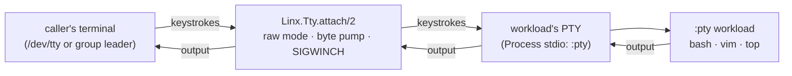

# Overview

`Linx.Tty` is the terminal surface for an interactive workload — the
`termios`, `/dev/tty`, and PTY `ioctl` primitives plus the `attach/2` byte
pump that wires a `stdio: :pty` workload to the caller's terminal, giving the
BEAM a `docker attach` experience.

Terminals are a coherent kernel concept: a line discipline, the controlling-
terminal abstraction behind `/dev/tty`, the `termios(3)` struct, and the
`TIOC*` `ioctl(2)` surface (notably window size). `Linx.Process` already knows
how to give a workload its own PTY with `stdio: :pty`; `Linx.Tty` is the
interactive layer that connects that PTY to a human. Its core verb, `attach/2`,
puts the caller's terminal into raw mode and pumps bytes both ways — keystrokes
in, program output out — restoring the terminal exactly on exit so a forgotten
raw mode can't strand the user. It deliberately opens `/dev/tty` directly
rather than the BEAM's group-leader-mediated stdio, the same way `vim` and
`less` do, and forwards live `SIGWINCH` resizes through to the workload. It is
not a shell, terminfo layer, or line editor — just the primitives a consumer
builds those on.

## Where it fits

Unlike `Linx.User`, `Linx.Capabilities`, and `Linx.Seccomp` — the checkpoint-
window verbs that constrain a workload *before* `execve` — `Linx.Tty` operates
*after* `proceed/1`, on a running `:pty` workload. It is the post-launch
counterpart: those subsystems decide what the process may do, `Linx.Tty`
decides how a human talks to it. It pairs specifically with
`Linx.Process`'s `stdio: :pty` (the PTY allocation) and `pty_set_winsize/2`
(resize propagation); a terminal-in-the-browser or `kubectl exec -it`-style
consumer is what drives it.

## Flow

## Learn more

- **API** — `Linx.Tty` (verbs `attach/2`, `open_controlling_raw/0`,
  `restore_and_close/2`, `window_size/1`), with `Linx.Tty.WindowSize`,
  `Linx.Tty.Saved` (the restore blob), and `Linx.Tty.Error`
- **Examples** — [tty-examples.md](tty-examples.md): attaching, the `:controlling` vs
  `:group_leader` modes, save/restore, window size
- **References** — [tty-references.md](tty-references.md): `termios(3)`, `tty_ioctl(4)`,
  the PTY man pages, and the Erlang I/O-protocol notes
