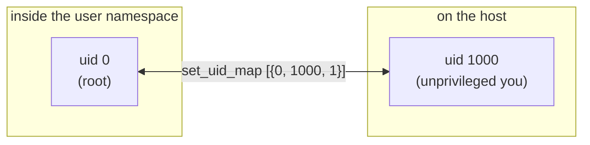

# Overview

`Linx.User` configures a workload's identity inside a Linux **user
namespace** — the uid/gid mappings that decide who the process *is* on the
inside versus who it really is on the host.

A user namespace gives a process its own uid/gid space: an id inside the
namespace can map to a completely different id outside it. The headline trick
is **rootless containers** — be uid 0 (full root) inside your own namespace
while being an ordinary unprivileged user (uid 1000) on the host, with no
elevated privilege leaking across the boundary. The kernel exposes this purely
through procfs: three write-once files (`uid_map`, `gid_map`, `setgroups`)
under `/proc/<pid>/`. `Linx.User` is the thin, NIF-free wrapper that writes and
reads them, encoding the kernel's ordering rules (deny `setgroups` before an
unprivileged `gid_map` write) and write-once semantics so a caller doesn't have
to rediscover them.

## Where it fits

`Linx.Process.spawn(namespaces: [:user, ...])` *creates* the user namespace;
`Linx.User` decides what identity it carries. Like `Linx.Cgroup`, `Linx.Mount`,
and `Linx.Netlink`, it is a checkpoint-window verb: the maps are written from
the host while the child sits parked between `:ready` and `proceed/1`, because
they are write-once and must be in place before the workload's first
instruction. `Linx.Process` has zero awareness of mappings — the checkpoint is
the only coupling. A container engine is the consumer that sequences the map
writes alongside the other checkpoint verbs.

## Flow

A workload that runs as root inside its own namespace, backed by your own
unprivileged host uid — full power in the container, none of it on the host.

## Learn more

- **API** — `Linx.User` (verbs `setup_maps/2`, `set_uid_map/2`, `set_gid_map/2`,
  `deny_setgroups/1`, `read_uid_map/1`), with `Linx.User.Map` (a parsed map
  entry) and `Linx.User.Error`
- **Examples** — [user-examples.md](user-examples.md): the rootless mapping, the
  `{inside, outside, length}` shape, the setgroups dance, reading maps back
- **References** — [user-references.md](user-references.md): `user_namespaces(7)` and the
  procfs surface
